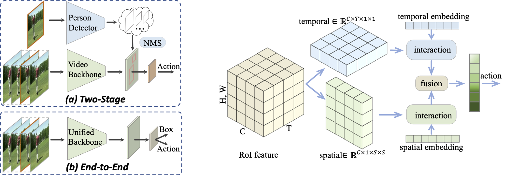

## Watch Only Once: An End-to-End Video Action Detection Framework

## Paper (ICCV 2021)

[Watch Only Once: An End-to-End Video Action Detection Framework](https://openaccess.thecvf.com/content/ICCV2021/papers/Chen_Watch_Only_Once_An_End-to-End_Video_Action_Detection_Framework_ICCV_2021_paper.pdf)

[Shoufa Chen](https://www.shoufachen.com/), [Peize Sun](https://peizesun.github.io/), [Enze Xie](https://xieenze.github.io/), [Chongjian Ge](https://scholar.google.com/citations?user=R8mtv14AAAAJ&hl=zh-CN), [Jiannan Wu](https://scholar.google.com/citations?user=1euA66EAAAAJ&hl=en), [Lan Ma](), [Jiajun Shen](), and [Ping Luo](http://luoping.me/)
## Updates
- (10/2021) Releasing code.
